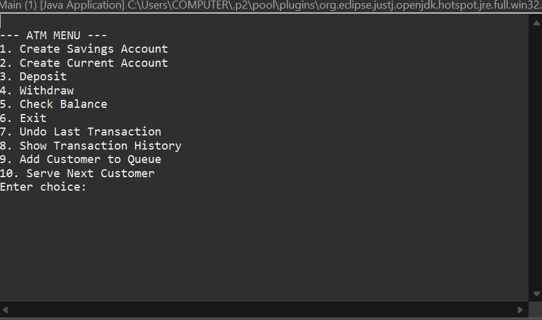

# 🏦 Banking System (ATM Simulation)

An intermediate-level **Java console application** that simulates basic ATM operations using **Object-Oriented Programming (OOP)** and **Data Structures & Algorithms (DSA)** concepts.

This project is designed to demonstrate clean OOP design, real-world banking logic, and effective use of data structures.

---

## ✨ Features

- Create **Savings Account** and **Current Account**
- Deposit money
- Withdraw money with balance validation
- Check account balance
- Transaction handling
- Menu-driven console interface

---

## 🧠 Concepts Used

### Object-Oriented Programming
- Abstraction (Abstract `Account` class)
- Inheritance (`SavingsAccount`, `CurrentAccount`)
- Encapsulation
- Polymorphism
- Exception Handling

### Data Structures
- `HashMap` → Account number to Account mapping
- `Stack` → Transaction history (undo support)
- `Queue` → Customer service simulation

---

## 🛠️ Technologies Used

- Java
- Eclipse IDE
- Java Collections Framework

---

## ▶️ How to Run

1. Clone or download the repository
2. Open the project in **Eclipse IDE**
3. Run the `Main.java` file
4. Follow the on-screen ATM menu

---

## 📸 Output Screenshot

You can see a sample output of the application below:

---

## 📌 Future Enhancements

- File handling / database integration
- User authentication (PIN-based login)
- Mini statement generation
- GUI version using JavaFX or Swing

---

## 👩‍💻 Author

**Renita Jasmine T.**  
Java | OOP | DSA | Problem Solving
